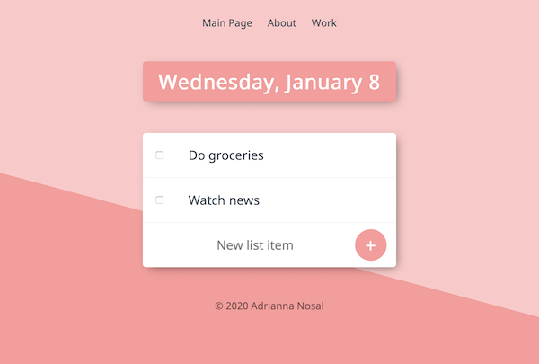

# To Do List Web App v2

### Deployed version on Heroku can be found **[here](https://get-things-done-here.herokuapp.com)**.

Source code for a simple to do list website that:
* displays current day of the week and date
* takes user input to add to the list
* crosses out checked items
* can go to sepereate *Work* list
* has an *About* page
* connects to MongoDB locally (can be changed to Atlas)

Made using Node.js(Express.js), EJS

Website is not yet adjusted to mobile view.
